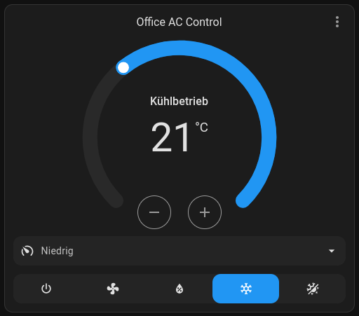
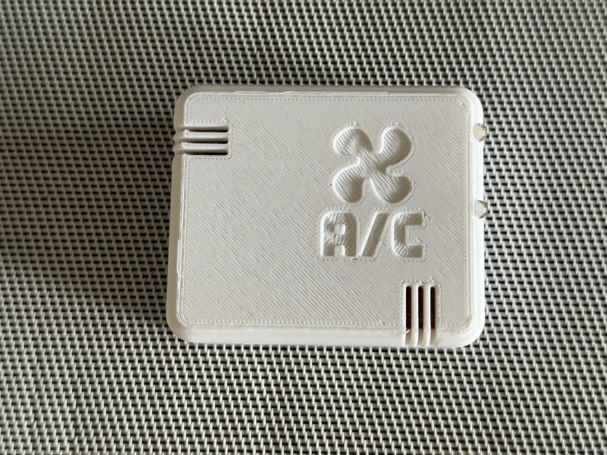
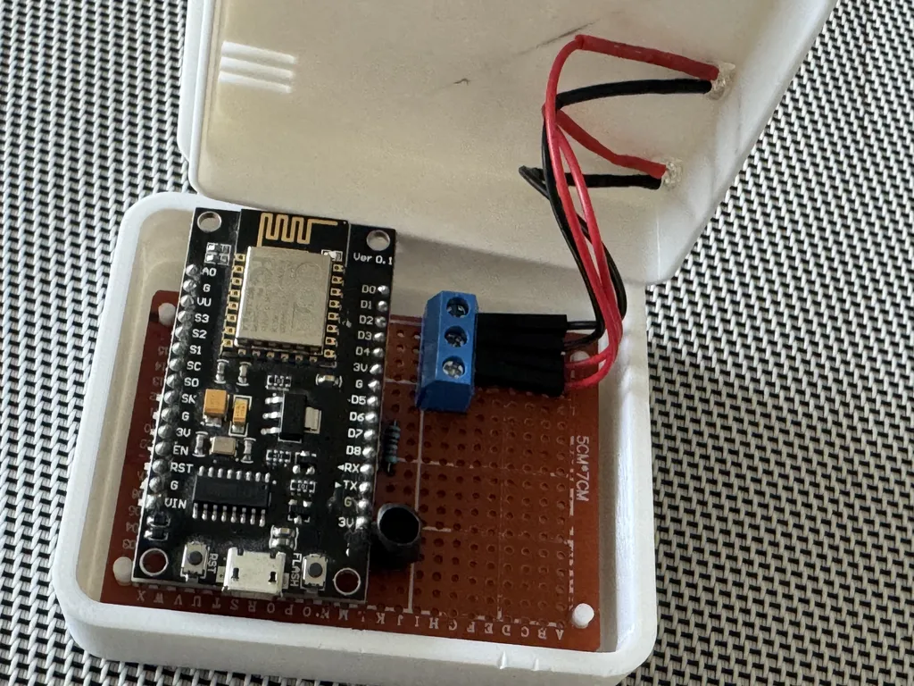
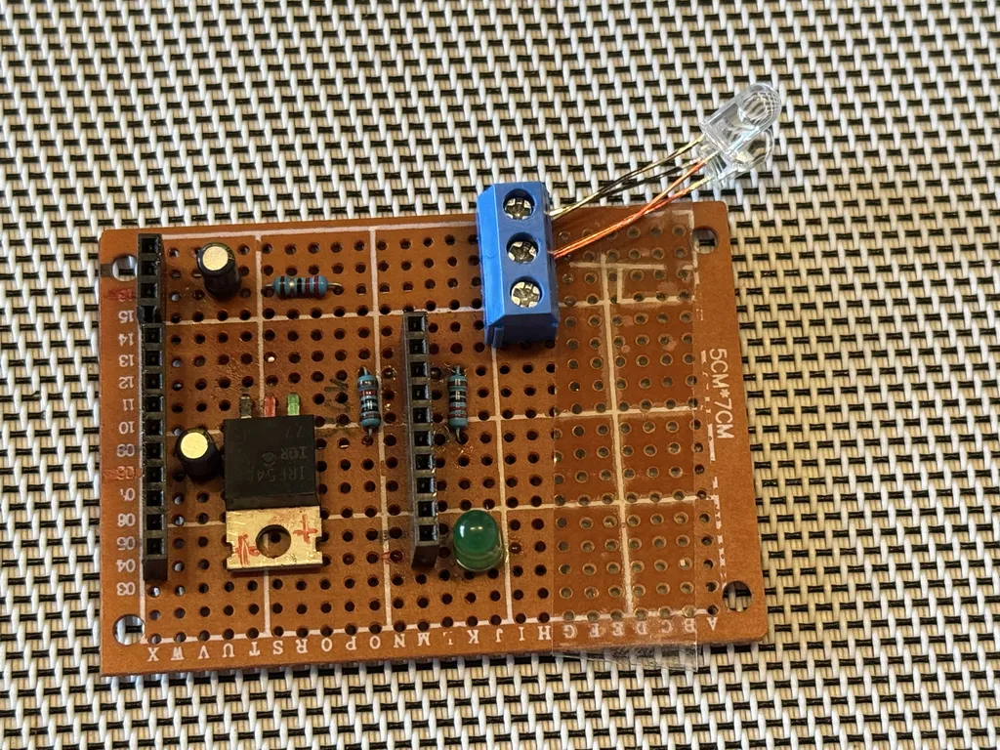

# WiFi IR Remote for Tosot AC for Home Assistant (ESPHome DIY Project)

## Description

I built a WiFi IR remote control for my Tosot Air Conditioner (Tosot Twin AG12) using [IR Remote Climate component](https://esphome.io/components/climate/climate_ir.html) from [ESPHome](https://esphome.io/) 
and [Home Assistant](https://www.home-assistant.io/).

The IR remote control is based on an ESP8266 board (Wemos LoLin D1 R2 & Mini). It's a DIY project, so you need to solder the parts together.


[Check, if your Tosot Air Conditioner is compatible with the IR Remote Climate component of ESPHome.](https://esphome.io/components/climate/climate_ir.html)


## Pictures

### Interface in Home Assistant

This interface comes from the IR Remote Climate component of ESPHome and is used to control my Tosot Air Conditioner.

### Case for the IR Remote Control


The Case was designed by me. Find it here on thingyverse.
Note: The A/C Logo is not included in the 3D model.



Note: The green LED is just a power indicator and NOT an essential part of the ir remote control. In the diagrams and item list below, it is not mentioned.


### My soldering solution for the IR remote control (can be improved, but it works)


Notes:
- There is one electrolytic capacitor too much soldered, it was a mistake, but I was to lazy to remove it. See Fritzing diagram below for the correct wiring. The correct electrolytic capacitor needs to be connected to the 5 V of the ESP8266 board.
- The green LED is just a power indicator and NOT an essential part of the ir remote control. In the diagrams and item list below, it is not mentioned.


## Requirements
- [Home Assistant 2025.5.0](https://www.home-assistant.io/) or later (earlier versions may work but are not tested)
- Installed [ESPHome](https://esphome.io/) add-on in Home Assistant
- Tosot Air Conditioner with IR remote control <br> 
  *(Adapt it to your specific device in [`esphome-ir-remote.yaml`](source/esphome-ir-remote.yaml) config)*
- ESP8266-based board (like Wemos LoLin D1 R2 & Mini).<br>
  *(Adapt it to your specific device in [`esphome-ir-remote.yaml`](source/esphome-ir-remote.yaml) config)*
- see **parts list** below for soldering

## Building it together!


### Parts for soldering
- 1x ESP8266 board (e.g., Wemos LoLin D1 R2 & Mini)
- 1x Grid hole board
- 2x IC Sockets (optional, but recommended for easy replacement of the ESP8266 board)
- 1x PCB Screw Terminal Block (optional, but recommended for easy connection of the IR LED)
- 1x IR LED (e.g., IR 7373C EVL)
- 1x Electrolytic capacitor (10 µF)
- 1x Resistor ≈ 20 Ω (for IR LED)
- 1x Resistor 1 kΩ (as pull-down)
- 1x Resistor ≈ 100 Ω (as pre-resistor after the D7 pin)
- 1x Mosfet (e.g., IRF 540N)


### Fritzing Diagram
You need to adapt this Fritzing diagram to your specific grid hole board. This is just a demonstration of how the parts should be connected.


#### Some Soldering Instructions

*Note: All resistors and capacitors are calculated for my specific board and IR combination. You may need to adjust them for your specific need.*

- Connect the "Source" pin of the Mosfet to the GND of the ESP8266 board.
- The 'Drain' pin of the Mosfet is the power supply for the IR LED. Remember to add a ≈ 20 Ω resistor in series to the IR LED.
- Connect the 'Gate' pin of the Mosfet to the D7 pin of the ESP8266 board and add a pre-resistor of ≈ 100 Ω to this line (green wireing).
  Additionally, add a pull-down resistor of 1 kΩ to the GND of the ESP8266 board.


**Have fun soldering! See you in the next section!**

### Source Code / YAML Config for IR Remote Control

Source file: [`esphome-ir-remote.yaml`](source/esphome-ir-remote.yaml)

For Installation of a generic ESPHome device, reed the dokumentation here: https://esphome.io/guides/getting_started_hassio.

- First install ESPHome on your Microcontroller (e.g., Wemos LoLin D1 R2 & Mini) and connect it to your Home Assistant instance.
  (It must be listed in the ESPHome Device Builder on your Home Assistant instance.)
- Adjust the [`esphome-ir-remote.yaml`](source/esphome-ir-remote.yaml) file to your needs, especially the WiFi credentials and the IR remote control settings.
- Then copy your adapted config file by "EDIT" your specific ESPHome Device in your ESPHome Device Builder and upload it.
 

``` yaml
esphome:
  name: tosot-twinag12-ir-remote
  friendly_name: ESPHome IR AC Control
  min_version: 2025.5.0
  name_add_mac_suffix: false


# Define your ESP board here
esp8266:
  board: d1_mini

# Enable logging
logger:

# Enable Home Assistant API
api:

# Allow Over-The-Air updates
ota:
  - platform: esphome

wifi:
  ssid: 'add_your_wifi_ssid_here'
  password: 'add_your_wifi_password_here'

remote_transmitter:
  id: retx
  pin:
    number: D7

  carrier_duty_percent: 50%

# Read the documentation to set up to your AC model
# see: https://esphome.io/components/climate/climate_ir.html
climate:
  - platform: gree
    name: "Living Room AC"
    model: yac
    icon: "mdi:air-conditioner"
    supports_heat: false
```


# License
Copyright (c) 2025 Paul Schulze
This project is licensed under the [MIT License](LICENSE).

